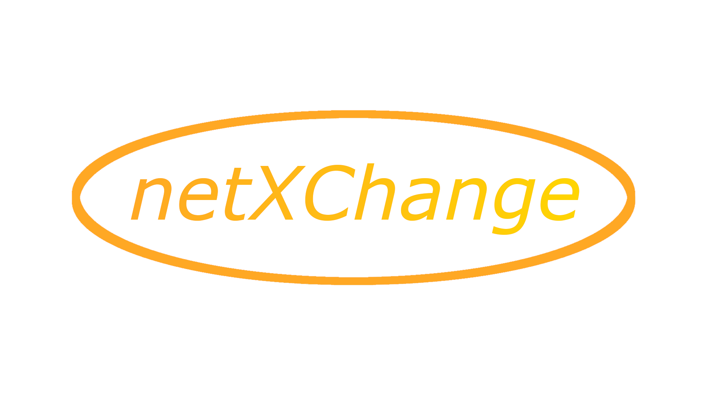

# Exchange Server pre-alpha 0.1.1a

### System Requirements

 - Unix/Linux Device
 - Quad Core intel i5 6500 equivalent or newer
 - 8 GB of RAM

### Vunrebility Reporting

This project cannot become safer without your support. If you find a vulnerability,
report it to the devs at [security@netXchange.org](mailto:security@netXchange.org)

### What is netXchange?

netXchange is a global, an address agnostic LAN over IP protocol. It allows users from all over the world to communicate
via a third party server. netXChange offers the highest levels of security by providing APIs for 
secure encrypted messaging using industry standard algorithms.

[Legal](LICENSE.md)

     This program is free software: you can redistribute it and/or modify it under the terms of the GNU General Public License as published by the Free Software Foundation, either version 3 of the License, or (at your option) any later version.

    This program is distributed in the hope that it will be useful, but WITHOUT ANY WARRANTY; without even the implied warranty of MERCHANTABILITY or FITNESS FOR A PARTICULAR PURPOSE. See the GNU General Public License for more details.

    You should have received a copy of the GNU General Public License along with this program. If not, see <https://www.gnu.org/licenses/>. 